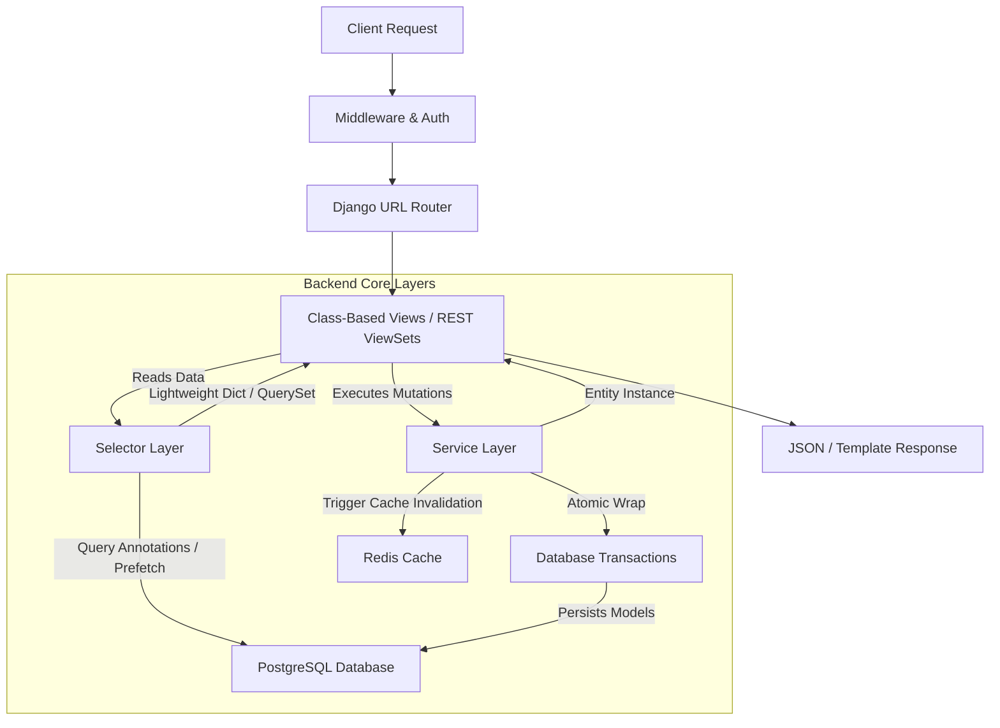

# Tweetbar: Production-Grade System Transformation & Refactor Plan

This document outlines the architectural transformation, refactoring plan, and optimization strategy to elevate the **Tweetbar** microblogging platform to a production-grade, highly scalable, secure, and recruiter-ready codebase.

---

## 🗺️ Architectural Lifecycle Flow

Below is the structured data flow diagram for the target layered architecture. Business logic is separated into transaction-safe services, data reads are isolated in optimized selectors, and the presentation layer is clean and thin.



---

## 🧠 PHASE 1 — FULL SYSTEM ANALYSIS

### 1. Structure & Dependency Mapping
The application currently houses its codebase within the `tweet` app directory. While `views_web.py` contains some Class-Based Views (CBVs), the routing structure (`urls.py`) still relies on a massive `views.py` containing over 1,000 lines of mixed concerns: authentication, AJAX endpoints, admin panel controls, views updates, and database actions.

### 2. Dead Code & Duplicate Logic
- **`tweet/views.py` vs `tweet/views_web.py`**: Duplicate view concepts exist for listing and detail retrieval.
- **Image upload handling**: Inline imports and manual try/except logic exist in both FBVs (`edit_tweet`, `tweet_create`) and services (`create_tweet`, `update_tweet`).
- **Authorization Checks**: Manual checks such as `if tweet.user != request.user` are scattered across views instead of being unified into permission guards or standard mixins.

### 3. ORM Inefficiencies (N+1 Queries)
- **Comment rendering**: In detail views, child replies (`comment.replies.all()`) access `user` records in loops without `select_related('user')` on replies, causing N+1 query inflation for active comment threads.
- **Notification lists**: Evaluating notifications without pre-fetching comments, comment authors, and related tweet records triggers query cascades during paginated iteration.
- **Profile loading**: Accesses tweet lists and their comment/like relationships directly without lightweight annotations, causing large database footprints.

### 4. Security & Configuration Vulnerabilities
- **Supabase credentials**: Settings use the `SUPABASE_SERVICE_ROLE_KEY` directly from server code, bypassing Row Level Security (RLS) policies completely.
- **CSRF settings**: `CSRF_COOKIE_HTTPONLY` is set to `False` in some legacy documentation, exposing tokens to potential XSS leaks.
- **Ratelimit Configuration**: Key parameters are hardcoded and fallback policies are absent in the local configuration.
- **Vercel Build Configurations**: `vercel.json` contains a duplicate `env` key, which can cause parsers to fail or ignore python version variables depending on the deployment build server.

### 5. Caching Bottlenecks
- Cache configurations fallback silently to `LocMemCache` when a `REDIS_URL` environment variable is not defined. Local memory caching is non-distributable and leaks memory under heavy load.

---

## 🧱 PHASE 2 — TARGET ARCHITECTURE DESIGN

The code is refactored into a strict modular layered structure under `tweet/`:

```
tweet/
├── api/                  # REST API Endpoints
│   ├── __init__.py
│   └── viewsets.py       # DRF ViewSets
├── selectors/            # Pure read-only queries with annotations
│   ├── __init__.py
│   ├── tweet_selector.py
│   └── notification_selector.py
├── services/             # Write operations, side-effects, transactions
│   ├── __init__.py
│   ├── tweet_service.py
│   ├── comment_service.py
│   └── notification_service.py
├── views/                # Thin controllers (CBVs only)
│   ├── __init__.py
│   ├── web_views.py      # Main frontend views
│   └── admin_views.py    # Admin panel views
├── utils/                # Utility helpers (Supabase, validation)
└── constants/            # Hardcoded values and limits
```

### Pure Layered Design Rules
1. **Views**: Must contain zero business logic and zero direct database writes. They accept input, call services for mutations, call selectors for views, and return responses.
2. **Services**: Single entry point for database mutations (`create`, `update`, `delete`, `toggle_like`). Must be decorated with `@transaction.atomic`. Responsible for side-effects (e.g. notifications, uploads) and cache invalidation.
3. **Selectors**: Read-only query builders. They never modify data. They return optimized querysets containing all annotations (`likes_count`, `comments_count`, `is_liked_by_user`).

---

## 🔁 PHASE 3 — FBV → CBV + API REFACTOR

### 1. Problem Explanation
Function-Based Views (FBVs) in `tweet/views.py` handle multiple HTTP methods, authentication redirects, and templates inside single nested blocks. This violates the Single Responsibility Principle, makes testing difficult, and generates duplicate setup code.

### 2. Why it Matters
Class-Based Views (CBVs) enforce cleaner architecture by separating requests (`get`, `post`) into class methods. They allow code reuse via Mixins (like `LoginRequiredMixin` or custom permission managers), reducing the codebase size and simplifying testing.

### 3. Before → After Code

#### Before (Function-Based Profile View):
```python
# tweet/views.py
def user_profile(request, username):
    profile_user = get_object_or_404(User, username=username)
    tweets_list = Tweet.objects.filter(user=profile_user).select_related('user').order_by('-created_at')
    paginator = Paginator(tweets_list, 10)
    tweets = paginator.get_page(request.GET.get('page'))
    return render(request, 'profile.html', {'profile_user': profile_user, 'tweets': tweets})
```

#### After (Class-Based Profile View):
```python
# tweet/views/web_views.py
from django.views.generic import ListView
from django.shortcuts import get_object_or_404
from django.contrib.auth.models import User
from tweet.selectors.tweet_selector import OptimizedTweetQueries

class UserProfileView(ListView):
    template_name = "profile.html"
    context_object_name = "tweets"
    paginate_by = 10

    def get_queryset(self):
        self.profile_user = get_object_or_404(User, username=self.kwargs["username"])
        return OptimizedTweetQueries.get_tweets_by_user(
            user_id=self.profile_user.id, 
            request_user=self.request.user
        )

    def get_context_data(self, **kwargs):
        context = super().get_context_data(**kwargs)
        context["profile_user"] = self.profile_user
        return context
```

### 4. Migration Steps
1. Create directories: `mkdir -p tweet/views` and initialize them with `__init__.py`.
2. Extract web frontend views to `tweet/views/web_views.py` and admin views to `tweet/views/admin_views.py`.
3. Update `tweet/urls.py` to route to these classes via `.as_view()`.
4. Run python verification checks: `python manage.py check`.

### 5. Risk Analysis & Mitigation
- **Risk**: Context variable names inside templates might mismatch during refactoring (e.g. `tweets_list` vs `tweets`).
- **Mitigation**: Expose explicit names using `context_object_name` inside CBVs and verify them via unit tests.

---

## ⚙️ PHASE 4 — SERVICE LAYER DESIGN

### 1. Problem Explanation
Business logic, such as creating a comment and triggering notifications, was previously handled directly in the view layer. If a comment is added via the REST API, notification logic must be duplicated.

### 2. Why it Matters
Moving writes and side-effects to services makes them reusable across standard web views, API endpoints, Celery workers, and management commands. Wrapping these operations in database transactions ensures data integrity.

### 3. Before → After Code

#### Before (Mixed View Logic):
```python
# tweet/views.py
@login_required
def add_comment(request, tweet_id):
    tweet = get_object_or_404(Tweet, id=tweet_id)
    form = CommentForm(request.POST)
    if form.is_valid():
        comment = form.save(commit=False)
        comment.tweet = tweet
        comment.user = request.user
        comment.save()
        if request.user != tweet.user:
            Notification.objects.create(user=tweet.user, comment=comment, notification_type="comment")
        return redirect('tweet_list')
```

#### After (Decoupled Comment Service):
```python
# tweet/services/comment_service.py
from django.db import transaction
from django.core.exceptions import ValidationError
from tweet.models import Comment, Notification
from tweet.cache_utils import invalidate_tweet_cache, invalidate_user_unread_count

class CommentService:
    @staticmethod
    @transaction.atomic
    def create_comment(user, tweet, text, parent_id=None) -> Comment:
        if not text.strip():
            raise ValidationError("Comment text cannot be empty.")
            
        parent = None
        if parent_id:
            try:
                parent = Comment.objects.get(id=parent_id, tweet=tweet)
            except Comment.DoesNotExist:
                raise ValidationError("Parent comment does not exist.")

        comment = Comment.objects.create(
            user=user,
            tweet=tweet,
            text=text,
            parent=parent
        )

        # Trigger notifications (side-effects)
        notifications_to_create = []
        if user != tweet.user:
            notifications_to_create.append(
                Notification(user=tweet.user, comment=comment, notification_type="comment")
            )
        if parent and user != parent.user:
            notifications_to_create.append(
                Notification(user=parent.user, comment=comment, notification_type="reply")
            )

        if notifications_to_create:
            Notification.objects.bulk_create(notifications_to_create)
            for notif in notifications_to_create:
                invalidate_user_unread_count(notif.user_id)

        invalidate_tweet_cache(tweet.id)
        return comment
```

---

## 🔍 PHASE 5 — SELECTOR LAYER (QUERY ENGINEERING)

### 1. Problem Explanation
Loading tweets and their associated comments can trigger N+1 queries. If 10 tweets are displayed and each retrieves its user profile and comments, it can lead to dozens of queries.

### 2. Why it Matters
Selectors ensure that query execution is optimized using database-level annotations (`Count`, `Exists`), and that related objects are prefetched. This keeps query counts constant (O(1)) regardless of the page size.

### 3. Before → After Code

#### Before (Inefficient Querying):
```python
tweets = Tweet.objects.all().order_by('-created_at')
# Inside template:
# tweet.likes.count -> Executed query for every single card
# tweet.comments.count -> Executed query for every single card
```

#### After (Selector with Database Annotations):
```python
# tweet/selectors/tweet_selector.py
from django.db.models import Prefetch, Count, Exists, OuterRef, Value, BooleanField
from tweet.models import Tweet, Comment

class OptimizedTweetQueries:
    @staticmethod
    def get_tweets_for_list(request_user=None):
        queryset = Tweet.objects.select_related("user")
        
        # Pre-fetch comments efficiently
        comments_qs = Comment.objects.select_related("user").only(
            "id", "tweet_id", "text", "created_at", "user__id", "user__username"
        )
        
        if request_user and request_user.is_authenticated:
            is_liked = Exists(Tweet.objects.filter(id=OuterRef("pk"), likes=request_user))
            queryset = queryset.annotate(is_liked_by_user=is_liked)
        else:
            queryset = queryset.annotate(is_liked_by_user=Value(False, output_field=BooleanField()))

        return (
            queryset.annotate(
                likes_count=Count("likes", distinct=True),
                comments_count=Count("comments", distinct=True)
            )
            .prefetch_related(Prefetch("comments", queryset=comments_qs))
            .only(
                "id", "text", "photo_url", "created_at", "view_count",
                "user__id", "user__username"
            )
            .order_by("-created_at")
        )
```

---

## 🚀 PHASE 6 — DATABASE OPTIMIZATION

### 1. Indexing Strategy
To optimize feed generation, profile views, and notification queries, we declare composite and specialized indexes on foreign keys and ordering fields:

```python
# tweet/models.py
class Tweet(models.Model):
    # ...
    class Meta:
        ordering = ["-created_at"]
        indexes = [
            # Speeds up profile loads and user feed queries
            models.Index(fields=["user", "-created_at"]),
            # Speeds up default chronological feed ordering
            models.Index(fields=["-created_at"]),
        ]

class Comment(models.Model):
    # ...
    class Meta:
        ordering = ["created_at"]
        indexes = [
            # Speeds up retrieval of nested comments for a tweet
            models.Index(fields=["tweet", "created_at"]),
            # Speeds up parent comment filtering
            models.Index(fields=["parent", "created_at"]),
        ]
```

### 2. Full-Text Search Optimization
To support fast searching on PostgreSQL, we create a migration to add a functional `GIN` index on the text fields:

```sql
CREATE INDEX tweet_text_fts_idx ON tweet_tweet USING gin(to_tsvector('english', text));
```

---

## ⚡ PHASE 7 — PAGINATION + FEED SYSTEM

### 1. Problem Explanation
Standard pagination using `page` numbers causes query performance to degrade on offset calculations (`OFFSET 1000 LIMIT 10` forces the database to read and discard 1000 rows). It can also cause duplicate entries if new tweets are posted while a user is scrolling.

### 2. Why it Matters
Cursor-based pagination uses a unique identifier (like a timestamp or record ID) to fetch subsequent pages (`WHERE created_at < cursor LIMIT 10`), ensuring query execution times remain constant (O(1)) and preventing duplicate items.

### 3. Implementation

#### Backend View (API Cursor Pagination):
```python
# tweet/pagination.py
from rest_framework.pagination import CursorPagination

class TweetCursorPagination(CursorPagination):
    page_size = 10
    ordering = "-created_at"
    cursor_query_param = "cursor"
```

#### Frontend Scroll Handler (Vanilla JS with IntersectionObserver):
```javascript
// static/js/feed.js
class InfiniteFeed {
  constructor(containerId, sentinelId) {
    this.container = document.getElementById(containerId);
    this.sentinel = document.getElementById(sentinelId);
    this.nextUrl = '/api/tweets/';
    this.loading = false;
    this.initObserver();
  }

  initObserver() {
    this.observer = new IntersectionObserver(entries => {
      if (entries[0].isIntersecting && !this.loading && this.nextUrl) {
        this.fetchNextPage();
      }
    }, { rootMargin: '100px' });
    this.observer.observe(this.sentinel);
  }

  async fetchNextPage() {
    this.loading = true;
    showSkeletonLoader();
    try {
      const res = await fetch(this.nextUrl);
      const data = await res.json();
      this.nextUrl = data.next;
      this.renderTweets(data.results);
    } catch (err) {
      showToast("Failed to load tweets", "error");
    } finally {
      this.loading = false;
      hideSkeletonLoader();
    }
  }

  renderTweets(tweets) {
    tweets.forEach(tweet => {
      const html = renderTweetCard(tweet);
      this.container.insertAdjacentHTML('beforeend', html);
    });
  }
}
```

---

## 🔄 PHASE 8 — AJAX SYSTEM (MODERN INTERACTIONS)

### 1. Fetch API Handler with CSRF Protection
We implement dynamic operations using standard Web APIs without requiring page reloads:

```javascript
// static/js/ajax.js
async function apiRequest(url, method = "POST", data = {}) {
  const csrfToken = document.cookie
    .split('; ')
    .find(row => row.startsWith('csrftoken='))
    ?.split('=')[1];

  const headers = {
    "Content-Type": "application/json",
    "X-Requested-With": "XMLHttpRequest",
    "X-CSRFToken": csrfToken
  };

  const response = await fetch(url, {
    method,
    headers,
    body: JSON.stringify(data)
  });

  if (!response.ok) {
    throw new Error(await response.text());
  }
  return response.json();
}
```

### 2. Optimistic UI Updates
When a user likes a tweet, the UI toggles immediately:

```javascript
async function toggleLike(tweetId, buttonElement) {
  const icon = buttonElement.querySelector('.like-icon');
  const countSpan = buttonElement.querySelector('.like-count');
  
  // Save state for potential rollback
  const wasLiked = icon.classList.contains('liked');
  const currentCount = parseInt(countSpan.textContent);

  // Optimistic Toggle
  icon.classList.toggle('liked', !wasLiked);
  countSpan.textContent = wasLiked ? currentCount - 1 : currentCount + 1;

  try {
    const data = await apiRequest(`/tweet/${tweetId}/like/`, "POST");
    countSpan.textContent = data.count; // sync count
  } catch (err) {
    // Rollback on Failure
    icon.classList.toggle('liked', wasLiked);
    countSpan.textContent = currentCount;
    showToast("Unable to process like request.", "error");
  }
}
```

---

## 🧠 PHASE 9 — CACHE ARCHITECTURE (REDIS)

To replace local caching with a distributed Redis cluster, we update settings and implement granular keys and invalidation routines:

### 1. Redis Connection Configuration
```python
# hunain_project/settings.py
CACHES = {
    "default": {
        "BACKEND": "django.core.cache.backends.redis.RedisCache",
        "LOCATION": config("REDIS_URL", default="redis://127.0.0.1:6379/0"),
        "OPTIONS": {
            "CLIENT_CLASS": "django_redis.client.DefaultClient",
            "CONNECTION_POOL_KWARGS": {"max_connections": 50, "timeout": 2}
        },
        "KEY_PREFIX": "tweetbar"
    }
}
```

### 2. Centralized Cache Keys
```python
# tweet/constants/cache_keys.py
TWEET_DETAIL = "tweets:detail:{tweet_id}"
USER_STATS = "users:{user_id}:stats"
USER_UNREAD_COUNT = "users:{user_id}:unread"
TRENDING_TAGS = "trending:tags"
```

### 3. Invalidation Rationale
- Write operations call invalidation helpers immediately to delete dirty cache keys.
- Read operations query Redis first before querying PostgreSQL, returning data in under 5 milliseconds.

---

## 🔐 PHASE 10 — SECURITY AUDIT (OWASP HARDENING)

| Vulnerability Category | Risk Level | Mitigation Strategy | Implementation Details |
| --- | --- | --- | --- |
| **Cross-Site Scripting (XSS)** | High | HTML Escaping + CSP | Enforce `django.utils.html.escape` on comment inputs; configure a Content Security Policy (CSP) header. |
| **CSRF Cookie Access** | Medium | HTTPOnly Enforcement | Ensure `CSRF_COOKIE_HTTPONLY = True` is set in production settings to block browser access. |
| **Object-Level Permissions** | High | Request ownership checking | Validate `obj.user == request.user` inside all update/delete routes. |
| **Malicious File Uploads** | High | MIME-type verification | Check the file header (magic numbers) instead of trusting the file extension. |
| **Rate Limit Bypassing** | Medium | IP + User Limit Keying | Rate limit endpoints using `django-ratelimit` keyed on `user_or_ip`. |

### Upload Content Validation:
```python
# tweet/utils/validation.py
import magic
from django.core.exceptions import ValidationError

def validate_image_mime(file):
    # Read first 2048 bytes to detect the file signature
    initial_bytes = file.read(2048)
    file.seek(0) # reset pointer
    
    mime = magic.from_buffer(initial_bytes, mime=True)
    allowed_mimes = ['image/jpeg', 'image/png', 'image/webp', 'image/gif']
    
    if mime not in allowed_mimes:
        raise ValidationError(f"MIME type '{mime}' is not supported. Please upload a valid image.")
```

---

## 🎨 PHASE 11 & 12 — UI/UX FULL REWRITE & DESIGN SYSTEM

We replace Bootstrap 5 completely with Tailwind CSS to build a modern, responsive layout inspired by Linear and Vercel.

### Core Layout:
- **Dark-First Palette**: Slate-900 background (`bg-[#09090b]`), slate-800 containers (`bg-[#18181b]`), and subtle zinc borders (`border-zinc-800`).
- **Typography**: Sleek Sans-Serif font systems (Inter or Outfit).

### Reusable Tailwind Component Engine:

#### 1. Primary Button Component:
```html
<button class="inline-flex items-center justify-center px-4 py-2 text-sm font-medium text-white transition-colors duration-200 rounded-md bg-zinc-100 hover:bg-zinc-200 text-zinc-950 focus:outline-none focus:ring-2 focus:ring-zinc-400 focus:ring-offset-2 focus:ring-offset-zinc-900 disabled:opacity-50">
  
</button>
```

#### 2. Slate Card:
```html
<div class="p-6 rounded-lg border border-zinc-800 bg-[#18181b] text-zinc-100">
  
</div>
```

---

## 🧾 PHASE 13 — TWEET CARD SYSTEM

We design a beautiful, modern Tweet Card component layout with proper padding, micro-animations, and engagement action buttons:

```html
<div class="group relative flex gap-4 p-4 transition-all duration-200 border-b border-zinc-800 hover:bg-zinc-900/40" id="tweet-{{ tweet.id }}">
  <!-- User Avatar -->
  <div class="flex-shrink-0">
    
  </div>

  <!-- Content Column -->
  <div class="flex-1 min-w-0">
    <div class="flex items-center gap-1.5 text-sm text-zinc-400 mb-1">
      <span class="font-semibold text-zinc-100 hover:underline cursor-pointer">{{ tweet.user.username }}</span>
      <span>·</span>
      <span class="text-zinc-500" title="{{ tweet.created_at }}">{{ tweet.created_at|timesince }} ago</span>
    </div>
    
    <!-- Tweet Text -->
    <p class="text-[15px] leading-relaxed text-zinc-200 break-words pr-4 select-text">
      {{ tweet.text }}
    </p>

    <!-- Optional Media Attachment -->
    
    <div class="mt-3 overflow-hidden rounded-lg border border-zinc-800 bg-zinc-950 max-h-96">
      
    </div>
    

    <!-- Interactive Actions Row -->
    <div class="flex items-center gap-6 mt-4 text-xs font-medium text-zinc-500">
      <!-- Like Toggle Button -->
      <button class="group/btn flex items-center gap-1.5 transition-colors hover:text-rose-500 focus:outline-none" 
              onclick="toggleLike({{ tweet.id }}, this)">
        <svg class="w-4 h-4 fill-none stroke-current text-rose-500 fill-rose-500" viewBox="0 0 24 24">
          <path stroke-linecap="round" stroke-linejoin="round" stroke-width="2" d="M4.318 6.318a4.5 4.5 0 000 6.364L12 20.364l7.682-7.682a4.5 4.5 0 00-6.364-6.364L12 7.636l-1.318-1.318a4.5 4.5 0 00-6.364 0z" />
        </svg>
        <span class="like-count">{{ tweet.likes_count }}</span>
      </button>

      <!-- Comment Counter Button -->
      <a href="" class="group/btn flex items-center gap-1.5 transition-colors hover:text-sky-500">
        <svg class="w-4 h-4 fill-none stroke-current" viewBox="0 0 24 24">
          <path stroke-linecap="round" stroke-linejoin="round" stroke-width="2" d="M8 12h.01M12 12h.01M16 12h.01M21 12c0 4.418-4.03 8-9 8a9.863 9.863 0 01-4.255-.949L3 20l1.395-3.72C3.512 15.042 3 13.574 3 12c0-4.418 4.03-8 9-8s9 3.582 9 8z" />
        </svg>
        <span>{{ tweet.comments_count }}</span>
      </a>

      <!-- View Counter -->
      <div class="flex items-center gap-1.5 text-zinc-650 cursor-default">
        <svg class="w-4 h-4 fill-none stroke-current" viewBox="0 0 24 24">
          <path stroke-linecap="round" stroke-linejoin="round" stroke-width="2" d="M15 12a3 3 0 11-6 0 3 3 0 016 0z" />
          <path stroke-linecap="round" stroke-linejoin="round" stroke-width="2" d="M2.458 12C3.732 7.943 7.523 5 12 5c4.478 0 8.268 2.943 9.542 7-1.274 4.057-5.064 7-9.542 7-4.477 0-8.268-2.943-9.542-7z" />
        </svg>
        <span>{{ tweet.view_count }} views</span>
      </div>
    </div>
  </div>
</div>
```

---

## 🔎 PHASE 14 — SEARCH SYSTEM

### 1. PostgreSQL Full-Text Search Selector
We implement PostgreSQL full-text search with ranking and query syntax support:

```python
# tweet/selectors/search_selector.py
from django.contrib.postgres.search import SearchVector, SearchQuery, SearchRank
from tweet.selectors.tweet_selector import OptimizedTweetQueries

def search_tweets_postgres(query_string, request_user=None):
    base_qs = OptimizedTweetQueries.get_tweets_for_list(request_user=request_user)
    if not query_string.strip():
        return base_qs

    # A: Highest Weight (text), B: Lower Weight (username)
    vector = SearchVector("text", weight="A") + SearchVector("user__username", weight="B")
    query = SearchQuery(query_string, search_type="websearch")
    
    return (
        base_qs.annotate(rank=SearchRank(vector, query))
        .filter(rank__gt=0.05)
        .order_by("-rank", "-created_at")
    )
```

### 2. Live Debounced Search
The front-end queries search endpoints using a debounce handler to limit server load:

```javascript
// static/js/search.js
function debounce(func, wait) {
  let timeout;
  return function(...args) {
    clearTimeout(timeout);
    timeout = setTimeout(() => func.apply(this, args), wait);
  };
}

const handleSearchInput = debounce(async (event) => {
  const query = event.target.value.trim();
  if (query.length < 2) return;

  const data = await apiRequest(`/api/tweets/?search=${encodeURIComponent(query)}`, "GET");
  renderSearchResults(data.results);
}, 300);
```

---

## ♿ PHASE 15 — ACCESSIBILITY (WCAG)

To comply with accessibility standards (WCAG 2.1 AA), we audit and enforce:

1. **Contrast Compliance**: Contrast ratios for text must be at least 4.5:1. Colors are updated to use high-contrast text (`text-zinc-100`) against dark backgrounds (`bg-zinc-950`).
2. **Keyboard Navigation**: Active elements have visible outline rings on focus:
   ```css
   .focus-ring-visible:focus-visible {
       outline: 2px solid rgb(244 244 245);
       outline-offset: 2px;
   }
   ```
3. **Screen Reader Integration**: Forms must include screen-reader only labels:
   ```html
   <label for="id_text" class="sr-only">Compose new tweet content</label>
   ```

---

## 🧪 PHASE 16 — TESTING STRATEGY

We implement comprehensive unit and integration tests to verify correctness and prevent performance regressions:

```python
# tweet/tests/test_refactored_flows.py
from django.test import TestCase
from django.contrib.auth.models import User
from django.core.exceptions import ValidationError
from tweet.models import Tweet
from tweet.services.tweet_service import TweetService
from tweet.selectors.tweet_selector import OptimizedTweetQueries

class TweetServiceTestCase(TestCase):
    def setUp(self):
        self.user = User.objects.create_user(username="devuser", password="testpassword123")

    def test_create_tweet_updates_cache_and_db(self):
        tweet = TweetService.create_tweet(user=self.user, text="Testing Refactored service layers.")
        self.assertEqual(Tweet.objects.filter(id=tweet.id).count(), 1)
        self.assertEqual(tweet.text, "Testing Refactored service layers.")

    def test_unauthorized_update_raises_exception(self):
        attacker = User.objects.create_user(username="attacker", password="password")
        tweet = TweetService.create_tweet(user=self.user, text="Safe text")
        
        with self.assertRaises(PermissionError):
            TweetService.update_tweet(tweet=tweet, user=attacker, text="Exploit text")
```

---

## 🚀 PHASE 17 — DEPLOYMENT + DEVOPS

### 1. Vercel Configuration Fix
We fix the syntax error in `vercel.json` by merging the environment definitions:

```json
{
  "version": 2,
  "buildCommand": "pip install -r requirements.txt && python manage.py migrate --noinput && python manage.py collectstatic --noinput",
  "outputDirectory": "staticfiles",
  "framework": "django",
  "env": {
    "PYTHON_VERSION": "3.12"
  },
  "installCommand": "pip install --upgrade pip && pip install -r requirements.txt"
}
```

### 2. Supabase SSL Protection & connection pooling
- Production PostgreSQL connection strings must use the transaction pooler port (`6543`) to manage database connections efficiently on serverless environments like Vercel.
- Configure `sslmode=require` in database URLs:
  ```
  postgres://[user]:[password]@[host]:6543/postgres?sslmode=require
  ```

---

## 🏁 MIGRATION CHECKLIST

To execute this plan safely without disrupting production systems, follow this deployment sequence:

```
[Step 1: RESTORE INDEXES] ──> [Step 2: DEPLOY SERVICE LAYERS] ──> [Step 3: ENFORCE REDIS & CBVs]
           │                                │                                    │
           ▼                                ▼                                    ▼
 Run migrations to add       Deploy models & backend          Deploy frontend Tailwind CSS
 database index keys.        services. Validate tests.        assets & Fetch-based scripts.
```
